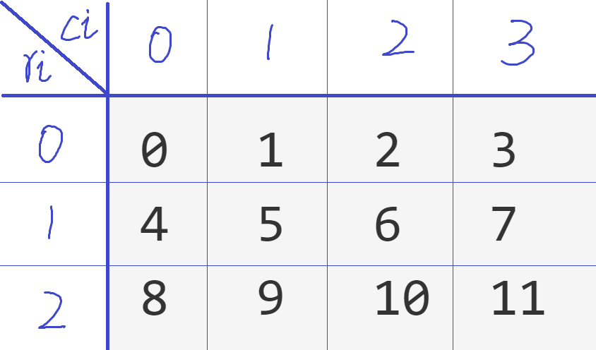

## 二维列表行列与序数关系
> 第二章 中期练习题 中等 第5题

### 题目
#### 背景介绍
本题目主要是探究二维列表行号列号，与其格子序号之间的关系。
这在二维的格子游戏或者相关的计算问题中，非常常用。


#### 简介
实现两个函数（分别实现）

1. 函数一`cal_order(m, n, ri, ci)`，
接受两个四个整数作为参数。

返回`m`行`n`列的表格(二维列表)中，
`ri`行`ci`列对应的格子的序号。

1. 函数二`cal_rc(m, n, order)`，
接受两个三个整数作为参数。

返回`m`行`n`列的表格(二维列表)中，
序号为`order`的格子的行列索引。
返回两个值，`return`时将两个值用逗号隔开。

补充：
默认`m`，`n`都是正整数。
默认输入的行列索引和序号都是不超过表格的。

#### 详细说明
`3`行`4`列的表格(二维列表)，
其每个格子的序号(order)如下
```txt
0   1   2   3   
4   5   6   7   
8   9   10  11  
```
其实就是从左往右，从上往下，从0开始的计数。

格子序号`order`和行列索引`ri, ci`的关系如下图所示



所以`ri=1, ci=2`对应的格子
序号`order`为6

格子序号`order=9`的
对应的行列索引为`ri=2, ci=1`

#### 函数一运行示例
示例一
```python
print(cal_order(3, 4, 1, 2))
```
输出为
```txt
6
```

示例二
```python
print(cal_order(5, 6, 2, 3))
```
输出为
```txt
15
```
#### 函数二运行示例
示例一
```python
print(cal_rc(3, 4, 9))
```
输出为
```txt
(2, 1)
```

示例二
```python
print(cal_rc(6, 5, 18))
```
输出为
```txt
(3, 3)
```
### 分割线
本小段没有实际意义，
仅用于分隔题目和答案。
防止学生无意中直接看到答案，
影响思路。
。
。
。
。
。
。
。
。
。
。
。
。
。
。
。
。
。
。
。
。

### 答案
#### 函数一
```python
def cal_order(m, n, ri, ci):
    order = ri * n + ci
    return order
```
#### 函数二
```python
def cal_rc(m, n, order):
    ri = order // n
    ci = order % n
    return ri, ci
```
